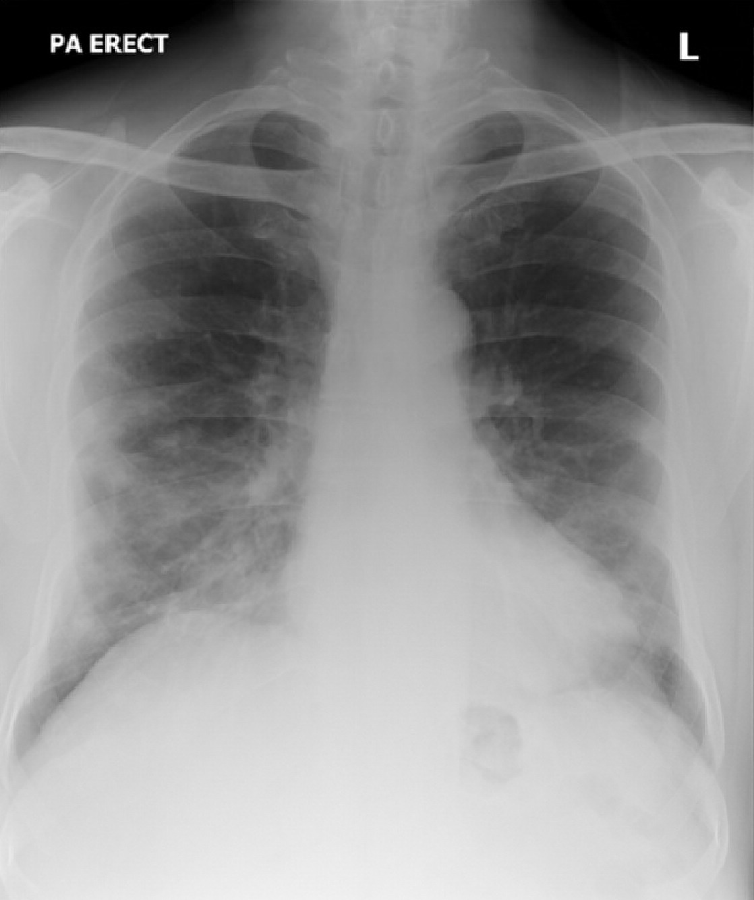
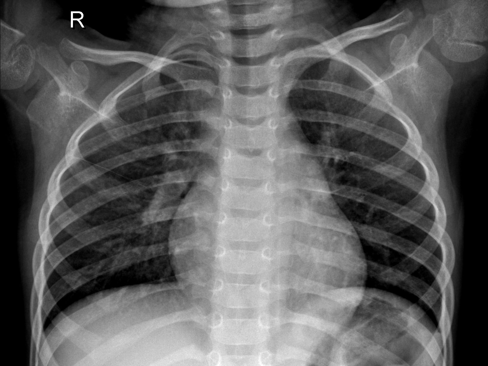
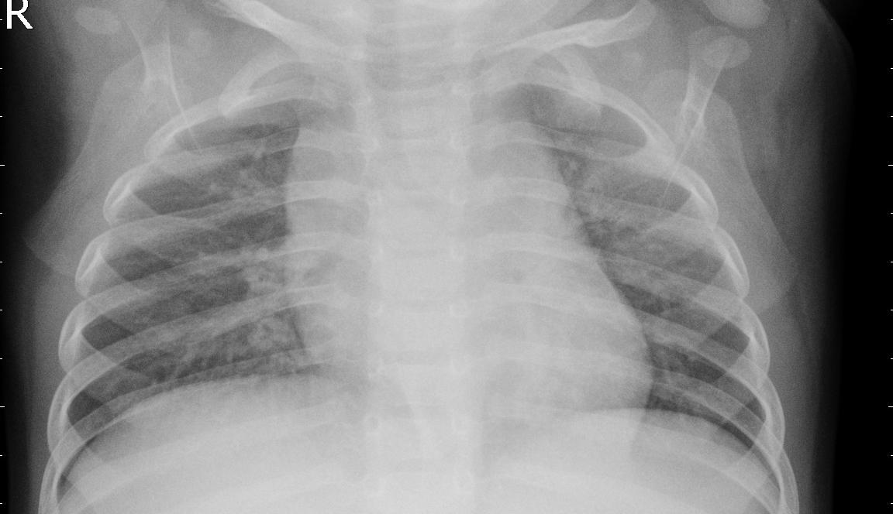
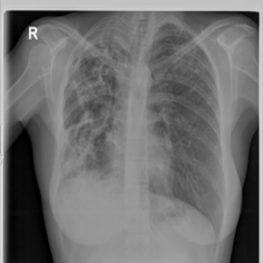

# 
Explainable AI for Chest X-Ray Analysis

#### This is the history to track our progress.

1. Findout dataset of xray and save in dataset folder.
    
   

       
       
       
       
   

### Covid19   $~~~~~~~~~~~$   Normal  $~~~~~~~~~~~$   Pneumonia  $~~~~~~~~~~~$  Tuberculosis
3. Convert all images into same extension (jpg).
4. feature extraction using DenseNet saved in *save_features.csv*.
5. apply Dense Neural Network (DNN) classifier and generate tarined model named *dnn_classifier.pkl*
6. Developed Flask API to host the model and process image uploads from the frontend.
7. Developed Flutter application.

Some Required Files = [Google Drive Link](https://drive.google.com/drive/folders/1BbfmUoDlft2BvakvLJ5ndcyxdFIJBOtK?usp=sharing)
